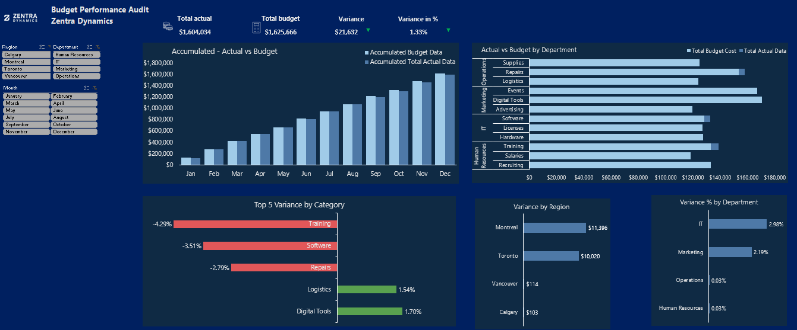

# Budget Performance Audit Dashboard — Zentra Dynamics

## Project Overview
This project simulates an executive-level **Budget vs Actual performance monitoring** solution for a mid-sized organization operating across multiple regions and departments in Canada.

The goal is to provide a **decision-ready dashboard** that helps finance and business leaders quickly identify budget deviations, cost overruns, and areas for improvement.

### Quick Links
- 📊 **Dashboard (Excel)** — `dashboard/Zentra_Budget_Performance_Dashboard.xlsx`
- 📄 **Executive Summary** — `documentation/Executive_Summary.md`
- 🧠 **Methodology & Workflow** — `documentation/Methodology_Workflow.md`
- 🧩 **Project Context** — `documentation/Project_Context.md`

---

## Business Problem
Zentra Dynamics lacked a centralized and visual way to monitor budget execution. Reporting was fragmented and reactive, limiting visibility into:
- Which departments and regions were overspending
- What expense categories were driving variances
- How performance evolved month-over-month and year-to-date

## Solution
An interactive Excel dashboard built with **Power Query and Power Pivot** that enables:
- Budget vs Actual comparisons (monthly and YTD)
- Variance analysis (**$ and %**)
- Identification of top deviation categories
- Performance flags to highlight overspending and cost-saving opportunities
- Filtering by region, department, and reporting period

## Key Features
- Star-schema data model implemented in Power Pivot
- Power Query transformations for clean and repeatable refresh steps
- Custom DAX measures for variance and cumulative analysis
- Executive-focused layout with clear KPI storytelling

## Tools & Skills Demonstrated
- Microsoft Excel (Power Query, Power Pivot)
- DAX (variance, percentage variance, cumulative/YTD logic)
- Data modeling (star schema)
- Financial performance analysis and executive reporting

## Repository Contents
- `dashboard/` — Final Excel dashboard file  
- `screenshots/` — Dashboard and model screenshots for quick review  
- `documentation/` — Project context, methodology, and executive summary (Markdown)  
- `data/` — Source data notes and structure overview  

## How to Review (Recommended)
1. Start with `/screenshots/` for a fast visual overview  
2. Open the Excel dashboard from `/dashboard/`  
3. Review the documentation in `/documentation/` for context and insights  

## Author
**Juan Pablo Briceno Ramos**  
Business & Financial Analyst | Toronto, Canada  
LinkedIn: https://www.linkedin.com/in/juan-p-briceno
